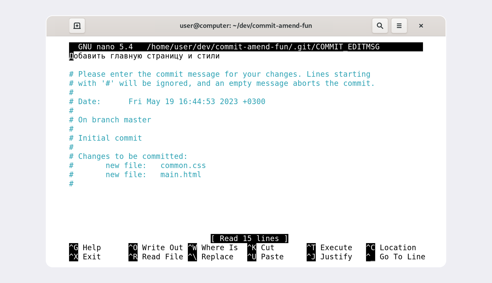
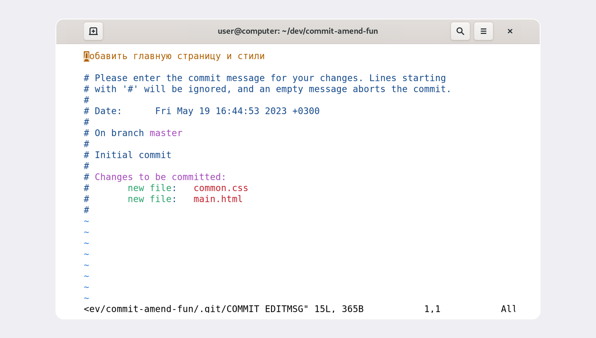

_\* Внимание! Данный документ не является образовательным, это лишь моё практическое задание на отработку навыков синтаксиса **markdown** и применения некоторых команд для работы с **Git**. Однако, если кому-то эти заметки принесут пользу — буду только рад!_

# Git-шпаргалка

(_несколько простейших команд для работы с консолью и с_ **git**)

---

#### базовые команды для консоли:

```bash
pwd — команда показывает путь до директории, в которой находимся в данный момент
```

```bash
cd example/my_project — перейти по указанному пути.
```

```bash
cd ~ — перейти в домашнюю директорию (благодаря символу ~)
```

```bash
ls — показать содержимое текущей директории
```

```bash
ls -a — показать содержимое текущей директории со скрытыми файлами
```

```bash
touch file.txt — создать файл
```

```bash
mkdir — создать директорию
```

```bash
mkdir -p dir1/dir-inside/dir-deeper-inside — создание целой структуры директорий
```

```bash
cp ЧТО_КОПИРУЕМ КУДА_КОПИРУЕМ — копирование файлов (пример: cp index.html src/)
```

```bash
cp index.html style.css script.js src/ — для копирования нескольких файлов
```

```bash
mv ЧТО_ПЕРЕМЕСТИТЬ КУДА_ПЕРЕМЕСТИТЬ — переместить файл (аргументы по принципу копирования)
```

```bash
cat file.txt — прочитать файл. Работает только с текстовыми файлами.
Вывести этой командой файл другого типа (например, изображение) не получится!
```

```bash
rm file.txt — удаление файла
```

```bash
rmdir files — удаление папки (files) при условии, что ПАПКА ПУСТА
```

```bash
rm -r files — удаление папки СО ВСЕМ СОДЕРЖИМЫМ.
Все команды удаления стирают данные безвозвратно — их нельзя будет восстановить из корзины!
```

```bash
&& — для выполнения сразу нескольких команд.
Пример: mkdir second-project && cd second-project && touch index.html style.css
```

#### Команды для работы с Git:

```bash
git init — сделать проект репозиторем (инициализировать git)
```

```bash
rm -rf .git — удалить подпапку git (если по ошибке инициализировали не в той директории)
    -rf — это:
      -r: (от англ. recursive — «рекурсивно») позволяет удалять папки вместе с их содержимым
      -f: (от англ. force — «заставить») избавит вас от вопросов вроде «Вы точно хотите удалить
      этот файл? А этот? И этот тоже?»
```

```bash
git status — проверить состояние (статус) репозитория.
Так же подскажет состояние файлов и какие команды можно выполнить, чтоб поменять состояние
```

```bash
git add file.txt — подготовить к сохранению файл в репозитории
```

```bash
git add --all
  и
git add . — подготовить к сохранению ВСЕ файлы в репозитории
```

```bash
git commit -m "Мой первый коммит!" — создать коммит (зафиксировать состояние
файлов, добавленных через git add).
Вместо "Мой первый коммит!" принято писать что-то более "говорящее" (например
"Исправлена ошибка..." или "добавлена функция") для понимания того, какие внесены изменения.
```

```bash
git log — Просмотреть историю коммитов
```

```bash
git log --oneline — Просмотреть сокращенный лог.
В терминале появятся только первые несколько символов хеша каждого коммита и их комментарии.
```

#### Несколько базовых команд для связки локального репозитория с удаленным:

- _Для такой связки нужно иметь аккаунт на хранилище репозиториев, например [GitHub](https://github.com/).
  (именно на примере работы с **GitHub** указаны команды ниже)_
- Рекомендуется ознакомиться с тем, как [создать репозиторий](https://docs.github.com/ru/get-started/quickstart/create-a-repo) после регистрации на **GitHub**

```bash
git remote add — привязывает локальный репозиторий к удаленному
```

Более полная привязка обычно выглядит так:

```bash

git remote add origin git@github.com:ИМЯ_АККАУНТА/first-project.git
Где origin — имя репозитория, далее SHH URL (можно увидеть при создании удаленного репозитория)
```

```bash
git remote -v — убедиться, что репозитории связаны.
(-v — короткая форма от --verbose (англ. «подробный»))
```

```bash
git push -u origin main(или master) — запушить на удаленный репозиторий самый первый коммит.
-u связывает локальный репозиторий с origin (удаленным) и создает на нём ветку main,
в которую и пушит
```

```bash
git push — запушить следующие коммиты
```

Простейший пример жизненного цикла в формате mermaid-схемы


```bash
git commit --amend --no-edit
Команда, которая вносит правки В ПОСЛЕДНИЙ коммит (HEAD)
--amend — внести правку в коммит (перед этим не забыть добавить нужный файл через git add)
--no-edit — не менять сообщение (название) коммита.
Если наоборот — нужно изменить название коммита, то вместо --no-edit будет команда
-m "Новое название". Полностью будет выглядеть так:
git commit --amend -m "Новое название последнего коммита"
```

---

#### Немного о Nano и Vim:

Если ввести команду `git commit --amend` и не добавить флаги `--no-edit` , или `-m`,
то Git предложит отредактировать сообщение коммита вручную. Для этого он откроет текстовый редактор, который установлен в системе по умолчанию. Чаще всего это либо **GNU nano**, либо **Vim**.

#####Nano:  
  
Символ **^** в nano означает клавишу **ctrl**  
Меняем заголовок и нажимаем `Ctrl+X` (выйти)  
После нажатия `Ctrl+X` nano предложит сохранить файл, для этого нужно нажать Y (от англ. yes).

Затем редактор предложит изменить имя файла, но делать этого не нужно — просто нажмите Enter.

Если вы не хотите менять сообщение через редактор, можно выйти из него с помощью `Ctrl+X`, а затем выбрать `N` (от англ. no). В таком случае редактор закроется, и Git оставит сообщение последнего коммита «как было».

#####VIM:  
  
Если вы ещё не умеете пользоваться Vim, мы рекомендуем сразу выйти из редактора и использовать флаг -m для указания сообщений коммита. Вот как выйти из Vim:

1. Нажмите клавишу `Esc`.
2. Наберите последовательность символов `:qa!`.
3. Нажмите `Enter`.

Редактор Vim — полезный инструмент, но его интерфейс сложно назвать интуитивным.
Для запуска учебника на русском языке достаточно выполнить команду `vimtutor ru`.
Без `ru` запустится английская версия.

---

##### Данная шпаргалка не закончена, продолжение следует...
