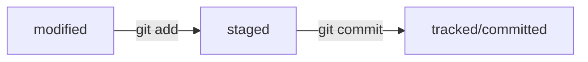
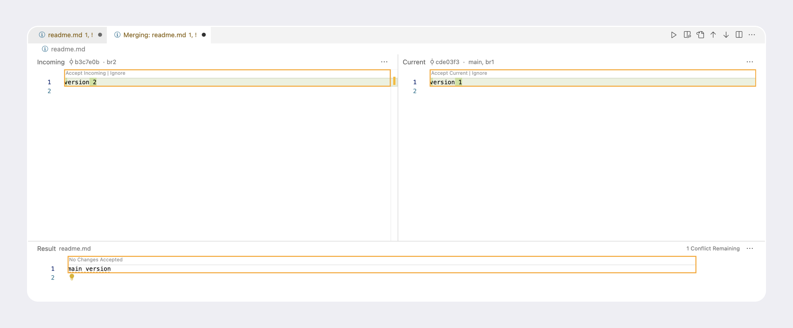
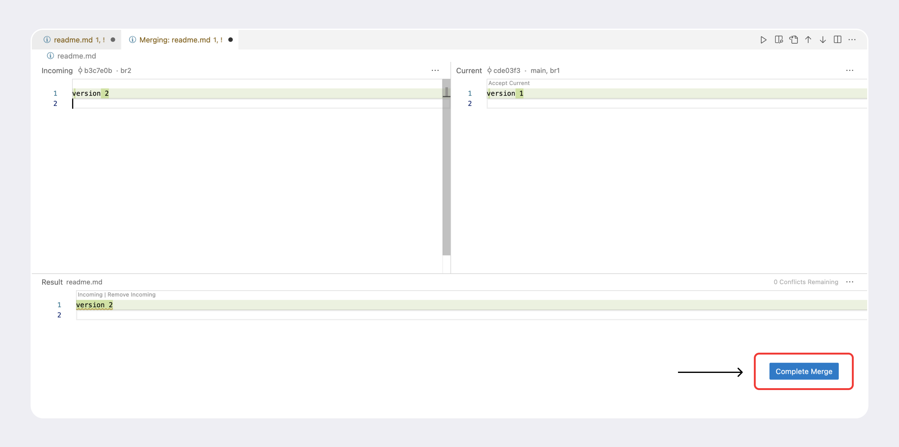
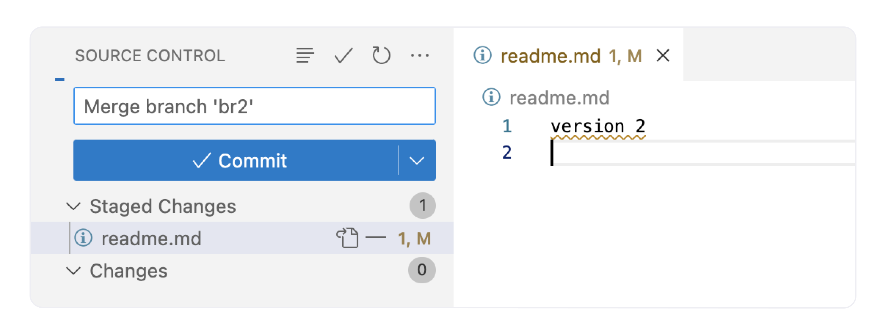

_\* Внимание! Данный документ не является образовательным, это лишь моё практическое задание на отработку навыков синтаксиса **markdown** и применения некоторых команд для работы с **Git**. Однако, если кому-то эти заметки принесут пользу — буду только рад!_

# Git-шпаргалка

(_несколько простейших команд для работы с консолью и с_ **git**)

---

#### базовые команды для консоли:

```bash
pwd — команда показывает путь до директории, в которой находимся в данный момент
```

```bash
cd example/my_project — перейти по указанному пути.
```

```bash
cd ~ — перейти в домашнюю директорию (благодаря символу ~)
```

```bash
ls — показать содержимое текущей директории
```

```bash
ls -a — показать содержимое текущей директории со скрытыми файлами
```

```bash
touch file.txt — создать файл
```

```bash
mkdir — создать директорию
```

```bash
mkdir -p dir1/dir-inside/dir-deeper-inside — создание целой структуры директорий
```

```bash
cp ЧТО_КОПИРУЕМ КУДА_КОПИРУЕМ — копирование файлов (пример: cp index.html src/)
```

```bash
cp index.html style.css script.js src/ — для копирования нескольких файлов
```

```bash
mv ЧТО_ПЕРЕМЕСТИТЬ КУДА_ПЕРЕМЕСТИТЬ — переместить файл (аргументы по принципу копирования)
```

```bash
cat file.txt — прочитать файл. Работает только с текстовыми файлами.
Вывести этой командой файл другого типа (например, изображение) не получится!
```

```bash
rm file.txt — удаление файла
```

```bash
rmdir files — удаление папки (files) при условии, что ПАПКА ПУСТА
```

```bash
rm -r files — удаление папки СО ВСЕМ СОДЕРЖИМЫМ.
Все команды удаления стирают данные безвозвратно — их нельзя будет восстановить из корзины!
```

```bash
&& — для выполнения сразу нескольких команд.
Пример: mkdir second-project && cd second-project && touch index.html style.css
```

```bash
echo "Привет!" — просто выведет Привет в консоль (дальше интересней)
```

```bash
echo "Вторая строка файла" >> file.txt — Допишет в файл сообщение "Вторая строка файла"
(именно ДОПИШЕТ, то есть, если в файле были другие записи, то они сохранятся)
Это благодаря ДВУМ знакам >>
```

```bash
echo "Новая строка" > file.txt — почти тоже самое, что и команда выше,
но из-за одного символа > другие записи в файле будут стёрты, добавится только новая
```

#### Команды для работы с Git:

```bash
git init — сделать проект репозиторем (инициализировать git)
```

```bash
rm -rf .git — удалить подпапку git (если по ошибке инициализировали не в той директории)
    -rf — это:
      -r: (от англ. recursive — «рекурсивно») позволяет удалять папки вместе с их содержимым
      -f: (от англ. force — «заставить») избавит вас от вопросов вроде «Вы точно хотите удалить
      этот файл? А этот? И этот тоже?»
```

```bash
git status — проверить состояние (статус) репозитория.
Так же подскажет состояние файлов и какие команды можно выполнить, чтоб поменять состояние
```

```bash
git add file.txt — подготовить к сохранению файл в репозитории
```

```bash
git add --all
  и
git add . — подготовить к сохранению ВСЕ файлы в репозитории
```

```bash
git commit -m "Мой первый коммит!" — создать коммит (зафиксировать состояние
файлов, добавленных через git add).
Вместо "Мой первый коммит!" принято писать что-то более "говорящее" (например
"Исправлена ошибка..." или "добавлена функция") для понимания того, какие внесены изменения.
```

```bash
git log — Просмотреть историю коммитов
```

```bash
git log --oneline — Просмотреть сокращенный лог.
В терминале появятся только первые несколько символов хеша каждого коммита и их комментарии.
```

#### Несколько базовых команд для связки локального репозитория с удаленным:

- _Для такой связки нужно иметь аккаунт на хранилище репозиториев, например [GitHub](https://github.com/).
  (именно на примере работы с **GitHub** указаны команды ниже)_
- Рекомендуется ознакомиться с тем, как [создать репозиторий](https://docs.github.com/ru/get-started/quickstart/create-a-repo) после регистрации на **GitHub**

```bash
git remote add — привязывает локальный репозиторий к удаленному
```

Более полная привязка обычно выглядит так:

```bash

git remote add origin git@github.com:ИМЯ_АККАУНТА/first-project.git
Где origin — имя репозитория, далее SHH URL (можно увидеть при создании удаленного репозитория)
```

```bash
git remote -v — убедиться, что репозитории связаны.
(-v — короткая форма от --verbose (англ. «подробный»))
```

```bash
git push -u origin main(или master) — запушить на удаленный репозиторий самый первый коммит.
-u связывает локальный репозиторий с origin (удаленным) и создает на нём ветку main,
в которую и пушит
```

```bash
git push — запушить следующие коммиты
```

Простейший пример жизненного цикла в формате mermaid-схемы




```bash
git commit --amend --no-edit
Команда, которая вносит правки В ПОСЛЕДНИЙ коммит (HEAD)
--amend — внести правку в коммит (перед этим не забыть добавить нужный файл через git add)
--no-edit — не менять сообщение (название) коммита.
Если наоборот — нужно изменить название коммита, то вместо --no-edit будет команда
-m "Новое название". Полностью будет выглядеть так:
git commit --amend -m "Новое название последнего коммита"
```

---

#### Немного о Nano и Vim:

Если ввести команду `git commit --amend` и не добавить флаги `--no-edit` , или `-m`,
то Git предложит отредактировать сообщение коммита вручную. Для этого он откроет текстовый редактор, который установлен в системе по умолчанию. Чаще всего это либо **GNU nano**, либо **Vim**.

##### Nano:

  
Символ **^** в nano означает клавишу **ctrl**  
Меняем заголовок и нажимаем `Ctrl+X` (выйти)  
После нажатия `Ctrl+X` nano предложит сохранить файл, для этого нужно нажать Y (от англ. yes).

Затем редактор предложит изменить имя файла, но делать этого не нужно — просто нажмите Enter.

Если вы не хотите менять сообщение через редактор, можно выйти из него с помощью `Ctrl+X`, а затем выбрать `N` (от англ. no). В таком случае редактор закроется, и Git оставит сообщение последнего коммита «как было».

##### VIM:

  
Если вы ещё не умеете пользоваться Vim, мы рекомендуем сразу выйти из редактора и использовать флаг -m для указания сообщений коммита. Вот как выйти из Vim:

1. Нажмите клавишу `Esc`.
2. Наберите последовательность символов `:qa!`.
3. Нажмите `Enter`.

Редактор Vim — полезный инструмент, но его интерфейс сложно назвать интуитивным.
Для запуска учебника на русском языке достаточно выполнить команду `vimtutor ru`.
Без `ru` запустится английская версия.

```bash
git restore --staged <file> — удалить файл из stage перед тем,
как добавить в коммит (если вдруг по ошибке добавили файл через git add).
Файл перейдет обратно в untracked.
```

```bash
git restore --staged . — удалить ВСЕ файлы из stage
```

```bash
git reset --hard <commit hash> — откатиться на другой коммит по хэшу (вернуть
состояние репозитория к более раннему)
```

```bash
git restore <file> — Откатить» изменения, которые не попали ни в staging,
ни в коммит
```

```bash
git diff — позволяет проверить изменения между текущей и предыдущей версиями
файла (пока он в modified до того, как через он git add попал в stage)
```

```bash
git diff --staged — позволяет проверить изменения между текущей и предыдущей версиями
файла, который через git add был добавлен в stage
```

```bash
git diff A B — (где A и B — хэши коммитов) команда для сравнения состояний между коммитами.
Обычно А — более раннее состояние, В — более позднее (или последний). Но можно и наоборот!
Если один из сравниваемых коммитов — последний добавленный, то вместо хэша можно использовать
слово HEAD (пример: git diff 6d69850 HEAD, или git diff HEAD b9c6824)
```

Так же командой `git diff` можно сравнивать ветки, но об этом в соответствующей теме.

##### Немного про `.gitignore`

```bash
.gitignore — файл с перечнем файлов и директорий. которые не будут добавлены в репозиторий.
```

Важно! Правила из .gitignore применяются только к новым (untracked) файлам. Если файл уже попал в staging area или в коммит, то правила на него не распространяются.

```bash
# — с решетки в gitignore начинаются комментарии
```

```bash
По названию файла (например text.txt)
В таком случае Git будет игнорировать файлы с именем text.txt, причём не только
в корне репозитория, но и во всех вложенных папках.
```

```bash
* — Символ звёздочки соответствует любой строке, включая пустую. Если такой символ
используется в шаблоне в .gitignore, значит, файл будет проигнорирован вне зависимости
от того, что будет на месте звёздочки.

*.jpeg — игнорировать все файлы, которые заканчиваются на .jpeg

docs/*/tmp — игнорировать все файлы "tmp" во всех подпапках папки docs (например
docs/current/tmp)
```

```bash
** — Двойная звёздочка соответствует любому количеству вложенных папок (в том числе нулю).
Одинарная может соответствовать только одной.

# игнорировать файлы "docs/current/tmp", "docs/old/tmp",
# а также "docs/old/saved/a/b/c/d/tmp"
# и даже "docs/tmp", потому что ноль вложенных папок тоже подходит
docs/**/tmp

# игнорировать только "docs/current/tmp" и "docs/old/tmp"
# файл "docs/old/saved/a/b/c/d/tmp" не попадает в правило
docs/*/tmp
```

```bash
? — Вопросительный знак соответствует одному любому символу.

file?.txt — будут проигнорированы, например, файлы fileA.txt и file1.txt. А вот файл file12.txt
не будет проигнорирован, потому что в его названии два символа после file, а не один.
```

```bash
file[0-2].txt — Квадратные скобки, как и вопросительный знак, соответствуют одному символу.
При этом символ не любой, а только из списка, который указан в скобках.
# Под множество попадут, например, файлы file0.txt, file1.txt и file2.txt.
# Не попадут file3.txt, file4.txt.
В скобках можно либо перечислить символы ([abc]), либо задать диапазон ([a-z])
```

```bash
/ — слеш, указывает на каталоги. Если шаблон в .gitignore начинается со слеша, то Git
проигнорирует файлы или каталоги только в корневой директории.
# игнорировать todo.txt в корне репозитория
/todo.txt
# для сравнения: spam.txt будет игнорироваться во всех папках
spam.txt

Если шаблон заканчивается слешем, то правило применится только к папке.
# игнорировать папку build
build/

При этом, если build — это папка, то она будет проигнорирована.
Если build — обычный файл, то он не подпадёт под правило и не будет игнорироваться.
```

```bash
! — инвертирует любое правило в .gitignore

# игнорировать все JPEG-файлы
*.jpeg

# но только не мем с Doge
!doge.jpeg
```

```bash
git status --ignored — отображает игнорируемые файлы при команде git status.
# Без флага --ignored игнорируемые файлы не отображаются, иначе они бы засоряли вывод.
```

##### git clone и fork

```bash
git clone <HTTPS или SSH путь до репозитория> — клонировать удаленный репозиторий
себе локально. Так же эта команда АВТОМАТИЧЕСКИ СВЯЗЫВАЕТ локальный репозиторий
с удалённым. То есть не нужно делать первый коммит командой git push -u origin,
достаточно просто git push.
```

###### Важно!

Не следует путать команду `git clone` с опцией `fork`! Форк не клонирует удаленный
репозиторий локально, а создает копию какого-то репозитория в Вашем аккаунте на
GitHub, которую уже в дальнейшем можно клонировать.

На случай, если вдруг попадается файл с расширением вроде этого check.sh

```bash
chmod +x check.sh — эта команда сделает файл исполняемым
./check.sh — эта команда исполнит скрипт
```

##### Про ветки

```bash
git branch — просмотреть ветки репозитория (*main — звездочкой будет отмечена ветка,
в которой находимся в данный момент)
```

```bash
git branch <название_ветки> — создать ветку
```

```bash
git checkout <название_ветки> — переключиться на другую ветку.

Этой же командой переключаемся в новую ветку склонированного репозитория,
поскольку вначале будет склонирована только основная ветка. Чтоб добавить остальные
ветки выпоняем git checkout <имя ветки, как в удаленном репозитории> и тогда ветка
добавится локально.
```

```bash
git checkout -b <название_ветки> — создать новую ветку и сразу же переключиться на неё
```

```bash
git diff <название_ветки1> <название_ветки2> — сравнить ветки.
Вместо названий ветки может быть её хэш (не забываем, что ветки — это указатель на коммиты)
```

```bash
~N — суффикс навигации, где N это число. Он отсчитывает от заданного коммита N коммитов
назад во времени.
Нумерация начинается с нуля: commit~0 — это сам коммит, commit~1 — предыдущий и так далее.

Для ~1 есть специальное сокращение ~ (без числа).
То есть вместо HEAD~1 обычно пишут просто HEAD~.

git diff HEAD~ HEAD — пример использования. Сравниваем предыдущий коммит с текущим.

git diff feature/diff~1 feature/diff — то же самое, но с названием веток и явным числом
коммитов назад (~1)

git diff 2ea56ab~ 2ea56ab — то же самое, но с хэшами.
```

```bash
git merge <название_ветки> — выполнить слияние веток. Имя ветки — это ветка, ОТКУДА хотим
влить изменения. Перед тем как начать процесс слияния, нужно перейти в ветку, КУДА должны
добавиться изменения.
```

```bash
git branch -D <название_ветки> — удалить ветку (после слияния, например).
Удалять какую-то ветку нужно находясь в другой!
```

```bash
git branch -d <название_ветки> — БОЛЕЕ БЕЗОПАСНЫЙ (маленькая -d) вариант удаления.
Он удалит ветку только если она была полностью объединена с другой.
```

###### ⚠️ Удаление локальной ветки через Git не удаляет ветку на GitHub!

```bash
git push -u origin <название ветки> — загрузить ветку из локального репозитория на удаленный.

Ранее уже говорилось о такой команде с веткой main и самым первым пушем, чтобы связать
репозитории. Далее с помощью такой команды можно добавить любую локальную ветку на
удаленный репозиторий (если в удаленном такая ветка отсутствует).
```

```bash
git pull — забрать изменения из удалённого репозитория
```

Дополнительно git pull и git merge выполняют перед тем, как создать пул-реквест. Рекомендуется сначала подтянуть изменения из основной ветки, объединить их с вашей, решить все возможные конфликты и лишь затем сделать push.
Порядок примерно такой:

```bash
git checkout main — перешли в main
git pull — подтянули новые изменения в main
git checkout my-branch — вернулись в рабочую ветку my-branch
git merge main — влили main в новую ветку my-branch
git push -u origin my-branch — отправили ветку my-branch в удалённый репозиторий
```

```bash
git remote rm origin — эта команда удалит текущий привязанный origin.

Может потребоваться, если, к примеру, мы работали с исходником, но затем сделали fork,
чтоб в дальнейшем работать с ним. Удалять локальную версию не хотим, поэтому отвяжемся
от удаленного первоисточника и привяжемся к форку с помощью git remote add origin и
ссылки на форк-репозиторий.
```

###### ⚠️ Немного про отключение fast-forward (ff).

Если хотим сделать `merge`, но без "перемотки", можно добавить флаг `--no-ff`.
Примерная команда будет выглядеть так:

```bash
git merge --no-ff <имя_ветки> — слияние веток без fast-forward

Так же есть дополнительный флаг --no-edit

git merge --no-edit --no-ff <имя_ветки> — этот флаг отключает ввод сообщения для merge-коммита

git config [--global] merge.ff false — отключить ff навсегда (пока не вернем обратно)
```

Если отключить слияние в режиме fast-forward, вместо «перемотки» ветки Git создаст в ней коммит слияния (merge commit).
Многие проекты отключают fast-forward слияние веток, потому что при нём теряется часть информации. Полноценный коммит слияния сохраняет всю информацию: в нём будет указано, какая именно ветка вливалась в (к примеру) main.

Для комфортного просмотра веток можно использовать флаг `--graph`:

```bash
git log --graph --oneline — этот флаг отобразит историю в виде "нарисованных" веток
```

Так же команде `git log` можно указать несколько веток:

```bash
git log --graph --oneline <ветка_1> <ветка_2> — выведет все ветки.
```

```bash
git push --force — форсированный пуш, флаг --force (англ. «сила», «заставить»).

К примеру, если в локальной ветке main добавили коммиты и, до того, как сделать пуш,
на удаленной ветке (origin/main) тоже добавился коммит, то флаг --force просто "выкинет"
коммит из origin/main и запишет туда из локальной по принципу fast-forward.
Опасный способ, поскольку можно потерять коммиты. Используется НЕчасто, но иногда полезен!
```

##### Немного о подходах работы с ветками

- **Feature branch workflow** — простой и самый популярный вариант. Если коротко, в нём для каждого нового изменения создаётся новая ветка, которая позже вливается в main с помощью git merge.
- **Git flow** — более сложный вариант. Подход похож на feature branch workflow, но в нём создаётся больше веток, а изменения (коммиты) делят на разные типы: исправление, новая функциональность и так далее. Разные типы коммитов попадают в разные ветки.
- **Trunk-based** — популярный в больших компаниях (таких как Яндекс, Google и прочих) подход, который обещает бо́льшую скорость работы в крупных командах.
  Этот подход тоже похож на _feature branch workflow_. Главное отличие в том, что участники проекта вливают (merge) свой код в основную ветку максимально часто. Например, каждый день.

```bash
\ — Слеш в конце консольной команды позволяет продлить её на следующую строку.

Например можно целиком написать многострочную команду:
mkdir git-conflict && cd git-conflict && git init && \
echo 'main version' > readme.md && git add . && git commit -m 'main' && \
git checkout -b br1 && echo 'version 1' > readme.md && git add . && git commit -m 'v1' && \
git checkout main && \
git checkout -b br2 && echo 'version 2' > readme.md && git add . && git commit -m 'v2'
```

```bash
git commit --no-edit — можно применять, например, при коммите после разрешения конфликтов,
чтоб не менять название коммита (флаг --no-edit)
```

**vimdiff** — инструмент слияния, который предосталяет редактор VIM

```bash
git mergetool — команда, которая вызывает VIMDIFF при возникновении конфликтов
```

Про _vimdiff_ упомянуто для полноты картины, обычно используют более удобные инструменты,
например возможности [VS Code](https://code.visualstudio.com/download).

Вспомогательные кнопки:

- **Accept Current Change** (англ. «принять текущие изменения») — разрешить конфликт через изменения, которые были раньше.
- **Accept Incoming Change** (англ. «принять входящие изменения») — разрешить конфликт через изменения, которые внесли вы.
- **Accept Both Changes** (англ. «принять все изменения») — добавить оба изменения одно за другим.

Если конфликт не самый простой, то у VS Code есть более мощный графический интерфейс для конфликтов. Чтобы его открыть, нажмите на кнопку **Resolve in Merge Editor** в правом нижнем углу экрана.

Вы увидите окно разрешения конфликтов. Оно состоит из трёх частей: в левой части содержатся новые изменения, в правой — текущие, а в нижней — результат.



Щёлкните на **Accept Incoming** в левой верхней части экрана. Все конфликты разрешены, поэтому теперь можно нажать на **Complete Merge**.



Готово! Остался последний шаг — создать коммит слияния. VS Code попытается сделать это автоматически в левой части экрана. Измените сообщение коммита, если нужно, и нажмите на кнопку **Commit**. Этот шаг также можно выполнить через консоль.



---

##### Данная шпаргалка не закончена, продолжение следует...
